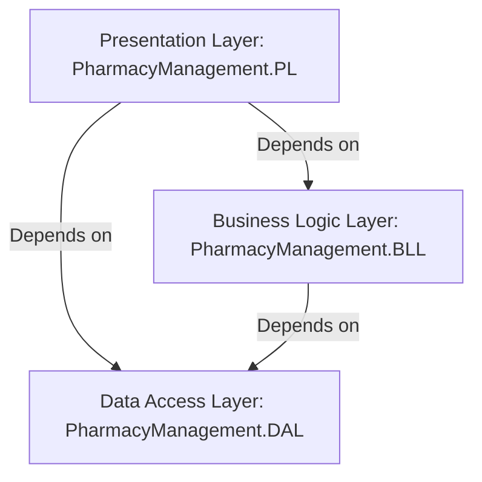

# Pharmacy Management System

A premium, enterprise-grade **Pharmacy Management System (PMS)** built using a modern **3-Tier (N-Tier) Architecture** in **.NET 10** and **ASP.NET Core MVC**. 

This system provides comprehensive automation for pharmacies, chemists, and drugstores—handling everything from Point-of-Sale (POS) cashier workflows and purchase management to batch-level medicine expiry tracking, employee shifts, role-based access control, audit logging, and advanced reporting with PDF/Excel generation.

---

## 🏗️ Architecture Overview

The codebase is organized into three distinct layers, ensuring clean separation of concerns, high testability, and clear dependency management:



### 1. [Presentation Layer (PL)](file:///c:/Users/AIuser/source/repos/PharmacyManagementSystem/PharmacyManagement.PL)
* **Technology**: ASP.NET Core MVC (Targeting `.NET 10`).
* **Responsibilities**: Handles user interaction, HTTP requests, UI rendering, cookie-based authentication, and custom middleware.
* **Key Components**:
  * **Controllers & Views**: Manage request routing and render HTML views utilizing Bootstrap.
  * **Middlewares**: Custom request-processing pipelines, including:
    * `LoginTrackingMiddleware`: Logs user login activities and session-related metadata.
  * **Services**: Presentation-specific services such as `InvoicePdfService` for PDF delivery.

### 2. [Business Logic Layer (BLL)](file:///c:/Users/AIuser/source/repos/PharmacyManagementSystem/PharmacyManagement.BLL)
* **Technology**: C# Class Library.
* **Responsibilities**: Executes domain business rules, processes calculations, coordinates transactions, validates input DTOs/ViewModels, and handles mapping.
* **Key Components**:
  * **Services**: Encapsulate core logic (e.g., `SalesService`, `PurchaseService`, `StockService`, `ReportService`, `NotificationService`).
  * **ViewModels**: Data transfer objects customized for UI consumption.
  * **Validators**: Powered by `FluentValidation` for strongly-typed, declarative model validation.
  * **Mapping Profile**: Powered by `AutoMapper` to map between database entities and ViewModels.

### 3. [Data Access Layer (DAL)](file:///c:/Users/AIuser/source/repos/PharmacyManagementSystem/PharmacyManagment.DAL)
* **Technology**: C# Class Library with Entity Framework Core (EF Core 10).
* **Responsibilities**: Manages database access, defines the persistence schema, implements repository patterns, and configures seeding.
* **Key Components**:
  * **DbContext**: `PharmacyDbContext` manages SQL Server connection configurations, entity configurations, and migrations.
  * **Entities**: Domain entities (e.g., `Medicine`, `MedicineBatch`, `SalesInvoice`, `PurchaseInvoice`, `Shift`, `AuditLog`, `UserActivity`).
  * **Repositories**: Standard Repository & Unit of Work patterns (`GenericRepository<T>` and `UnitOfWork`) to abstract database operations.
  * **Seeding**: Automatically seeds identity roles, system users, and initial lookups.

---

## 🛠️ Technology Stack & Libraries

* **Framework**: .NET 10.0
* **Web Engine**: ASP.NET Core MVC (Razor Views)
* **ORM**: Entity Framework Core 10 (SQL Server provider)
* **Database**: Microsoft SQL Server
* **Authentication & RBAC**: ASP.NET Core Identity
* **Validation**: FluentValidation (11.11.0)
* **Object Mapping**: AutoMapper (16.1.1)
* **PDF Document Design**: QuestPDF (2026.6.0)
* **Excel Reporting**: ClosedXML (0.105.0)

---

## 📂 Project Structure

```
PharmacyManagementSystem/
│
├── PharmacyManagementSystem.slnx        # Solution configuration file
│
├── PharmacyManagement.PL/               # Presentation Layer (MVC Web App)
│   ├── Controllers/                     # Controllers for routing (Account, Medicine, POS, Reports, etc.)
│   ├── Views/                           # Razor Views (.cshtml) grouped by controller
│   ├── wwwroot/                         # Static assets (CSS, JS, images, icons)
│   ├── Middlewares/                     # Custom request pipeline middlewares
│   ├── Program.cs                       # Application entry point & configuration
│   └── appsettings.json                 # Connection strings and app configuration
│
├── PharmacyManagement.BLL/              # Business Logic Layer (Services & DTOs)
│   ├── Services/                        # Business logic interfaces & implementation classes
│   ├── ViewModels/                      # Presentation-ready view models and DTOs
│   ├── Validators/                      # FluentValidation classes
│   └── Mapping/                         # AutoMapper profiles
│
└── PharmacyManagment.DAL/               # Data Access Layer (EF Core & Schema)
    ├── Data/                            # DbContext, Entities, and migrations
    ├── Repositories/                    # Repository and Unit of Work classes
    └── SeedingData/                     # Seed scripts for default roles and databases
```

---

## 🌟 Key Modules & Features

### 🛒 Point of Sale (POS) & Sales
* Fast Cashier interface to search medicines and checkout.
* Multi-item cart handling, calculating subtotals, VAT/taxes, discounts, and net totals.
* **Invoice Generation**: Renders PDF receipt invoices dynamically using `QuestPDF`.
* Automatic inventory validation and stock deduction during sales checkout.

### 📦 Inventory & Medicine Management
* Complete profiles containing Trade Name, Scientific Name, Strength, Form, Barcode, and Category.
* **Batch-Level Tracking**: Manages inventory at the batch level (`MedicineBatch` with SKU, batch number, manufacture date, and expiry date).
* Active vs. Pending inventory configurations.
* Automatic stock transaction ledger recording additions, sales, returns, and manual adjustments.

### ⚠️ Expiry & Stock Level Alerts
* **Notification System**: Monitors stock levels and flags items dropping below `MinStockLevel`.
* **Expiry Tracking**: Real-time identification of near-expiry and expired batches.
* Automated dashboard alerts to prevent dispensing expired products.

### 🧾 Purchase & Supplier Management
* Tracks purchases from suppliers and registers inbound invoices.
* Ingests new medicine batches automatically, updating current stock levels and standardizing purchase unit conversion factors.
* Compares purchase pricing history to help control margins.

### 🔄 Returns Management
* **Sales Returns**: Handles items returned by customers, tracks reasons (damaged, wrong item), and issues credit or processes returns.
* **Purchase Returns**: Processes returns to suppliers for damaged or expired items, subtracting inventory from specific batches.

### 🕒 Shift Tracking
* Cashiers and pharmacists can open and close shifts.
* Logs shift open times, close times, and associated users to ensure cash-drawer accountability.

### 🛡️ Security, Identity & Audit
* Powered by ASP.NET Core Identity.
* **Role-Based Access Control (RBAC)**: Distinct permissions for `Administrator`, `Pharmacist`, and `Cashier`.
* **Audit Trails**: Automatically logs modifications, updates, and key user actions to `AuditLogs` and `UserActivities`.

### 📊 Advanced Reports & Dashboards
* Real-time analytical dashboard displaying sales, purchases, and profit metrics.
* Generate and download custom Excel reports via `ClosedXML` and beautiful PDFs via `QuestPDF`.

---

## 🔑 Default Seeded Accounts

The application automatically seeds three default roles and user accounts into the identity database on startup:

| Role | Username / Email | Password | Purpose |
| :--- | :--- | :--- | :--- |
| **Administrator** | `admin@pharmacy.com` | `Admin@123` | Complete access to user management, logs, reports, and settings. |
| **Pharmacist** | `pharmacist@pharmacy.com` | `Pharma@123` | Access to medicine management, inventory, purchases, and stock reports. |
| **Cashier** | `cashier@pharmacy.com` | `Cashier@123` | Access to POS checkout, customer profiles, sales invoices, and sales returns. |

---

## 🚀 Getting Started

### 📋 Prerequisites
* [.NET SDK 10.0](https://dotnet.microsoft.com/download/dotnet/10.0) or higher.
* [MS SQL Server](https://www.microsoft.com/en-us/sql-server/sql-server-downloads) (LocalDB, Express, or Developer edition).

### ⚙️ Database Configuration
Update the database connection string in the `PharmacyManagement.PL/appsettings.json` file if your local SQL Server instance is different:

```json
"ConnectionStrings": {
  "DefaultConnection": "Server=.;Database=PharmacyDb;Trusted_Connection=True;TrustServerCertificate=True;"
}
```

### 🏃 Running the Application
Open your terminal at the project root directory and execute the following commands:

1. **Restore NuGet dependencies:**
   ```bash
   dotnet restore
   ```

2. **Build the solution:**
   ```bash
   dotnet build
   ```

3. **Run the Presentation Layer web project:**
   ```bash
   dotnet run --project PharmacyManagement.PL
   ```

4. **Access the application:**
   Open your browser and navigate to the local host URL shown in your terminal (typically `https://localhost:7001` or `http://localhost:5000`).

> [!NOTE]
> Database migrations and identity seed data are checked and applied **automatically** during application startup, so you don't need to manually run `Update-Database`.